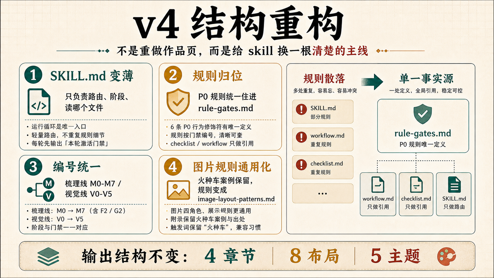

# Magazine Portfolio Skill


一句话说：这是一个给设计师、产品经理、独立创作者用的作品集网页 skill。它帮你把聊天记录、项目截图、复盘文档、图片文件夹，整理成一页招聘方能独立读懂的长滚动作品集网页。

它不是单纯的 HTML 模板。它更像一个作品集制作流程：先读懂素材，再写清项目故事，再放图片，最后生成网页并检查。

它早期受 [`guizang-ppt-skill`](https://github.com/op7418/guizang-ppt-skill) 的网页杂志表达启发：单文件 HTML、强视觉节奏、图文并行。但现在它不再是 guizang 的“作品集版本”，而是一套独立的长滚动作品集生成系统：核心能力放在素材证据、项目叙事、招聘方静态阅读、品牌组件和自动校验。

---

## 最近更新

### 2026-06-10 · v5 品牌系统闭环

2026-06-10 这版把“箱子探索者手记”从单页风格升级成可复用的品牌系统：新增电紫 Explorer Violet、Explorer Voice 五层字体系统、12 个 `x-` 组件、首页 H01-H06、Expedition Profile 考察档案机制，并把校验器扩展到 22 项。现在不同项目页可以用 `gold / rose / cyan` 三种考察档案表达差异，但主紫、字体、章节骨架和组件语言仍然保持统一。

### 2026-06-10 · v4 结构重构

2026-06-10 这版做的是“结构重构”：不是重做作品页视觉，而是把 skill 自己的执行主线理顺。`SKILL.md` 变成薄路由器，规则正文收归 `references/rule-gates.md`，梳理线和视觉线统一成 M/V 编号。4 章节、8 布局和 5 套继承主题保持兼容，同时新增箱子代表紫品牌扩展。

### 2026-05-29 · 模板激活与图片落位

2026-05-29 这版补的是“同一个 skill 怎么真的生效”：先确认页面继承母版、类名、字体颜色和章节节奏，再按图片角色决定总览、过程墙、细节条或现场照片，避免画风跑偏和图片被裁坏。

### 2026-05-27 · 终稿交付三道门

2026-05-27 这版补的是“交付前最后一关”：新增终稿口吻隔离、图片证据去重、浏览器验收三道检查，让作品集交出去前更像成品。

### 2026-05-26 · README 通俗化和配图说明

2026-05-26 这版重写了 README 的介绍方式：把说明对象从“维护者”改成“设计师和创作者”，新增三张中文信息图，并把它和 `guizang-ppt-skill` 的关系改成“早期受启发、场景相邻，但系统独立”。

---

## 它解决什么问题

很多作品集不是做不出来，而是卡在这几件事上：

- 素材很多，但不知道怎么讲成一个项目故事。
- AI 写出来很漂亮，但像空话，不像真实经历。
- 图片放进页面后，图文关系不清楚。
- 用户只想加图，AI 却顺手改了文案。
- 页面生成完了，但没有认真看浏览器效果。

这个 skill 的目标很简单：让作品集从“素材堆”变成“招聘方看得懂、信得过、能判断你能力”的项目页。

---

## 它怎么帮你做


完整流程可以理解成 5 步：

| 步骤 | 做什么 | 产出 |
|---|---|---|
| 1. 给素材 | 你提供截图、复盘、聊天记录、文件夹 | 素材入口 |
| 2. 找重点 | 从素材里找真实问题、你的动作、证据 | 源材料拆解 |
| 3. 写文案 | 先写事实，再写标题和金句 | 作品页文案稿 |
| 4. 放图片 | 每张图确认放哪、证明什么 | 图片落位表 |
| 5. 生成网页 | 做成长滚动 HTML，并用浏览器检查 | 单文件作品集网页 |

重点是：不要一上来就写页面。先把项目讲清楚，页面才会稳。

---

## 新版最大的变化：每一步都有检查点

过去很多规则会失效，是因为它们只是“提醒”：比如不要乱写、不要乱改文案、记得检查图片。任务一长，模型就容易忘。

新版把这些提醒改成检查点：每个阶段结束都要回答“做了什么、检查了什么、哪里没过、下一步怎么办”。如果没过，就不能继续往下走。


简单说：

```text
规则 = 什么时候触发 + 用在哪一步 + 要读哪些文件 + 怎么检查 + 没过怎么办
```

例子：

| 场景 | 检查点 | 没过怎么办 |
|---|---|---|
| 写文案 | 这句话有没有真实素材支撑？ | 没有就删掉或降级 |
| 进图 | 这张图放哪里、证明什么？ | 说不清就先不放 |
| 只加图 | 有没有改动已确认文案？ | 改了就撤回 |
| 生成网页 | 图片是否加载、手机端是否溢出？ | 回去修页面 |

详细规则放在 [`references/rule-gates.md`](./references/rule-gates.md)，但普通使用者只需要记住一句：每一步都要检查，没过就回退。

---

## 2026-06-10 更新：v4 结构重构

这次更新主要解决的是“规则太多时，AI 到底该先听哪一条”。旧版里很多好规则散在 `SKILL.md`、`workflow.md`、`checklist.md` 里，短任务能记住，长任务就容易漏。



v4 没有推翻作品页系统，也没有重做视觉模板。它做的是把 skill 内部整理成一条更清楚的主线：

| 改动 | 普通人理解 | 对使用有什么影响 |
|---|---|---|
| `SKILL.md` 变薄 | 入口只负责判断“现在该走哪一步” | 不再一上来塞满所有规则 |
| 规则归位 | P0 规则统一放进 `rule-gates.md` | 同一条规则只有一个版本 |
| 编号统一 | 梳理线叫 M0-M7，视觉线叫 V0-V5 | 长任务不容易走丢 |
| 图片规则通用化 | 火种车经验变成通用图片落位方法 | 别的项目也能复用 contain/cover、同组同高、移动端单列 |
| 检查清单瘦身 | checklist 只保留“要检查什么” | 检查更快，解释回到规则注册表 |

没有改的东西同样重要：`sections.md`、`components.md`、`content-density.md` 这些基础结构保持不变。所以旧作品页不用迁移，原来的 4 章节、8 种布局、5 套继承主题仍然照常使用；新增的第 6 套是箱子代表紫品牌扩展。

---

## 2026-06-10 更新：v5 品牌系统闭环

这次更新解决的是“多个 HTML 怎么既像一套，又各自有差异”。答案不是复制四份模板再局部乱改，而是把差异收进一套可验证的品牌系统。

v5 新增了三层护栏：

| 系统 | 做什么 | 为什么重要 |
|---|---|---|
| Explorer Violet | 用 `--brand-purple` 做唯一主紫，accent 只通过 `--accent-current` 小面积出现 | 第一眼是一套，而不是四张散页 |
| Explorer Voice | L1-L5 五层字体 + 9 级字号阶梯 | 紫底能喊出来，正文能讲清楚，批注能轻下来 |
| Expedition Profile | `gold / rose / cyan` 三份考察档案 | 火种车、春晚、KA21 可以有不同地貌色和声调 |

现在项目页必须在 `<body>` 声明自己的考察档案：

```html
<body data-expedition="gold">
```

三个预设档案分别是：

| 档案 | 项目气质 | 声调 |
|---|---|---|
| `gold` | 火种车、公益、行动、土地、现场温度 | 宣言体 `.voice-manifesto` |
| `rose` | 少儿 AI 春晚、舞台、节庆、传播 | 舞台体 `.voice-stage` |
| `cyan` | KA21、工具、数据、教程、方法验证 | 档案体 `.voice-archive` |

校验器也同步升级到 22 项：它会检查 `data-expedition` 是否注册、页面是否混入第二种 accent、`.voice-*` 是否只出现在燃烧态容器里。这样“差异化”不再靠感觉，而是可以被机器挡住边界。

---

## 2026-05-29 更新：模板激活与图片落位

这次更新主要补的是“同一个 skill 为什么有时没跑出同一套效果”。问题通常不在文案，而在两个地方：模板没有真正接管页面，图片也没有先判断角色。


可以理解成两道前置判断：

| 判断 | 要看什么 | 没过怎么办 |
|---|---|---|
| 模板激活 | 页面是否从母版起步，是否沿用类名、字体颜色和章节节奏 | 先回到 `assets/template.html` 或已验证母版页起步 |
| 图片落位 | 每张图承担什么角色：主视觉总览、过程证据墙、细节证据条、现场照片 | 先标图片角色，再决定放在哪一屏和怎么展示 |

这次还把图片处理法单独沉淀成 [`references/image-layout-patterns.md`](./references/image-layout-patterns.md)：内容图优先完整展示，照片可以更灵活；同组图片要同高，移动端要变单列，caption 要像介绍而不是审稿。

---

## 2026-05-27 更新：终稿交付三道门

这次更新主要补的是“最后交付前怎么别翻车”。它不是为了多加流程，而是把最容易让作品集显得不成熟的地方提前挡住。


可以理解成三道门：

| 门 | 检查什么 | 为什么重要 |
|---|---|---|
| 口吻隔离 | 内部检查可以写在稿子里，但最终网页不能出现“招聘方读到的是”“服务视角”等审稿话术 | 让页面像成品作品集，不像过程文档 |
| 图片去重 | 同一张图默认只出现一次，每张图都要说明放哪、证明什么 | 避免堆图，让图片变成证据 |
| 交付验收 | 浏览器检查图片加载、手机端溢出、页面语义和最终口吻 | 交出去前先过一遍真实阅读体验 |

新增的 `HTML内容架构稿` 就是为了解决第一件事：先把内部判断转成真正会出现在网页里的标题、正文、引用和图片说明，再生成 HTML。

---

## 你会得到什么

一次完整使用，通常会得到这些东西：

| 产物 | 用途 |
|---|---|
| `项目入口-XXX.md` | 用 7 个问题先把项目说清楚 |
| `原文摘录与真实问题拆解-XXX.md` | 从真实素材里找问题、动作和证据 |
| `素材采集表-XXX.md` | 每个主张对应哪些图片、截图、记录 |
| `作品页-XXX-内容架构稿.md` | 4 个章节，安排页面骨架 |
| `作品页-XXX-文案稿.md` | 先确认文案，再进入 HTML 内容架构稿 |
| `作品页-XXX-HTML内容架构稿.md` | 把内部检查口吻转成最终网页内容 |
| `index.html` | 最终长滚动作品集网页 |
| 图片落位表 / 素材清单 | 记录每张图放哪里、证明什么 |

最终网页是单文件 HTML，可以直接用浏览器打开。

---

## 简历说明

如果把这个项目写进简历，可以这样表达：

**Magazine Portfolio Skill · 设计工程学作品 / AI 作品集生成系统**

将“作品集生成”当作一个设计工程问题，独立设计并重构了一套面向设计师求职场景的 AI Skill 系统。它不是单页 HTML 模板，而是把素材理解、证据链组织、项目叙事、视觉系统、组件复用和质量校验串成一条可反复执行的作品集生产流程。系统采用薄路由器 + 门禁规则架构，将内容梳理与视觉生成拆成 M/V 两条工作流，并沉淀 4 章节叙事骨架、8 种页面布局、`x-` 组件库、Explorer Violet 品牌系统、Explorer Voice 字体系统和 Expedition Profile 差异化机制。为降低 AI 输出漂移，编写 22 项页面校验器，覆盖品牌色、字体 token、正文行高、中文斜体、考察档案、accent 混用和燃烧态 voice 使用边界。

可以拆成简历 bullet：

- 将作品集制作拆解为 M0-M7 内容梳理线与 V0-V5 视觉生成线，形成从真实素材到静态网页交付的完整 AI 工作流。
- 设计 G0-G7 门禁规则，将“不编造、不越权、模板激活、图片证据、浏览器验收”等质量要求转化为可执行的系统约束。
- 建立 Explorer Violet 品牌系统、Explorer Voice 五层字体系统、`x-` 组件库和 Expedition Profile 机制，使不同项目页既有统一识别，也能表达各自差异。
- 编写 22 项自动化页面校验器，覆盖色彩、字体、组件、叙事结构、正文可读性和视觉边界，降低 AI 生成作品集时的漂移风险。
- 将火种车、春晚、KA21 等项目页的实践经验抽象成可复用的 skill 系统，体现设计系统化、前端工程化和 AI 工作流设计能力。

---

## 适合谁

适合：

- 设计师、产品经理、独立创作者做求职作品集。
- 你手里有素材，但还没有讲成一个完整项目故事。
- 你希望作品集能被招聘方独立阅读，不需要你在旁边解释。
- 你需要真实图片、截图、过程证据进入页面。

不适合：

- 线下演讲 PPT。请用 [guizang-ppt-skill](https://github.com/op7418/guizang-ppt-skill)。
- 数据看板、课程课件、大段表格报告。
- 多页面整站、后端 API、复杂 SEO 工程。
- 编造不存在的项目、客户、数据或评价。

---

## 怎么触发

安装后，说这些话就适合调用它：

- “做一份长滚动作品集”
- “把这个项目素材整理成作品集网页”
- “做一个招聘方能读懂的项目页”
- “先做内容架构稿，再做 HTML”
- “只进图，不改文案”
- “这个作品集写得太空，帮我重新梳理”

---

## 安装

### Codex 安装

```bash
git clone https://github.com/xiangzi-cyber/magazine-portfolio-skill.git ~/.codex/skills/magazine-portfolio-skill
```

已安装过旧版时更新：

```bash
git -C ~/.codex/skills/magazine-portfolio-skill pull
```

### Claude Code 手动安装

```bash
git clone https://github.com/xiangzi-cyber/magazine-portfolio-skill.git ~/.claude/skills/magazine-portfolio-skill
```

---

## 文件结构

```text
magazine-portfolio-skill/
├── SKILL.md
├── README.md
├── CHANGELOG.md
├── assets/
│   ├── template.html
│   ├── readme-cover.png
│   ├── workflow-for-designers.png
│   ├── rules-as-checkpoints.png
│   ├── final-review-gates.png
│   ├── template-and-image-gates.png
│   └── v4-architecture-refactor.png
├── prompts/
│   └── readme-illustrations.md
├── scripts/
│   ├── validate-xiangzi-page.mjs
│   └── fixtures/
└── references/
    ├── agent-spec.md
    ├── rule-gates.md
    ├── workflow.md
    ├── 7-questions.md
    ├── content-architecture.md
    ├── material-collection.md
    ├── image-intake-and-screenshot-proof.md
    ├── image-layout-patterns.md
    ├── template-activation-and-brand-system-gate.md
    ├── sections.md
    ├── components.md
    ├── x-components.md
    ├── typography.md
    ├── expedition-profiles.md
    ├── homepage.md
    ├── themes.md
    ├── content-density.md
    ├── image-prompts.md
    └── checklist.md
```

核心文件：

| 文件 | 作用 |
|---|---|
| `SKILL.md` | skill 入口，告诉 AI 怎么调用这套流程 |
| `references/rule-gates.md` | 新版检查点系统，防止规则被忽略 |
| `references/workflow.md` | 从素材到文案稿的完整流程 |
| `references/typography.md` | Explorer Voice 五层字体系统 |
| `references/expedition-profiles.md` | 多项目差异化的考察档案机制 |
| `references/x-components.md` | 箱子探索者手记组件库 |
| `references/image-intake-and-screenshot-proof.md` | 图片入库、截图承托、只进图不改文案 |
| `references/checklist.md` | HTML 和视觉交付前检查清单 |
| `assets/template.html` | 可运行的长滚动网页模板 |

---

## 和 guizang-ppt-skill 的关系

最准确的说法是：这个 skill 和 [`guizang-ppt-skill`](https://github.com/op7418/guizang-ppt-skill) 有早期审美源流，但现在不再是“建立在 guizang 基础上的改版”。

`guizang-ppt-skill` 是横向网页 PPT，服务的是现场讲述、翻页节奏、演讲视觉和发布场景。`magazine-portfolio-skill` 是长滚动作品集系统，服务的是招聘方在没有讲解的情况下独立阅读，核心问题变成了证据链、项目叙事、图片角色、页面密度、品牌组件和自动校验。

早期 guizang 给了它“网页化杂志表达”的启发：单文件 HTML、杂志感版式、电子墨水气质和图文节奏。随着 v4/v5 重构，这个 skill 的主体已经长成了自己的工具链：

- M/V 双线工作流：先梳理真实素材，再进入视觉生成。
- G0-G7 门禁：把“不编造、不越权、模板激活、图片证据、浏览器验收”变成执行规则。
- 4 章节叙事、8 种页面布局、段落 6 件套：让作品页能被招聘方静态读懂。
- Explorer Violet、Explorer Voice、`x-` 组件和 Expedition Profile：形成自己的品牌系统。
- 22 项校验器：用机器检查品牌色、字体、正文行高、中文斜体、项目档案和燃烧态边界。

所以简历和项目介绍里，不建议再写“基于 guizang-ppt-skill 二次开发”。更合适的写法是：

> 早期参考网页杂志式表达，独立设计并重构了一套面向求职作品集的 AI Skill 系统，覆盖素材梳理、证据归位、叙事生成、品牌组件、长滚动网页模板和自动化页面校验。

实际使用时，它们可以协作，但不是上下游关系：同一份项目素材，可以先用 `magazine-portfolio-skill` 做招聘方阅读版；如果后面要路演、分享或汇报，再用 `guizang-ppt-skill` 做演讲版。

---

## License

[MIT License](./LICENSE)
