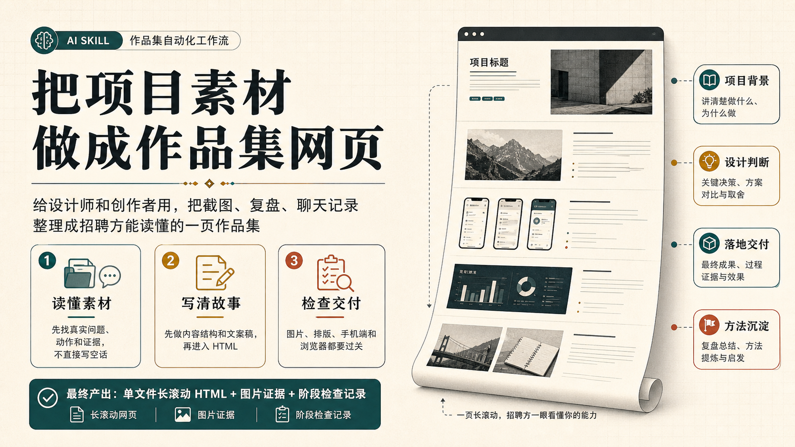
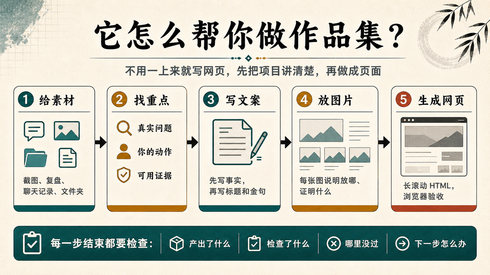
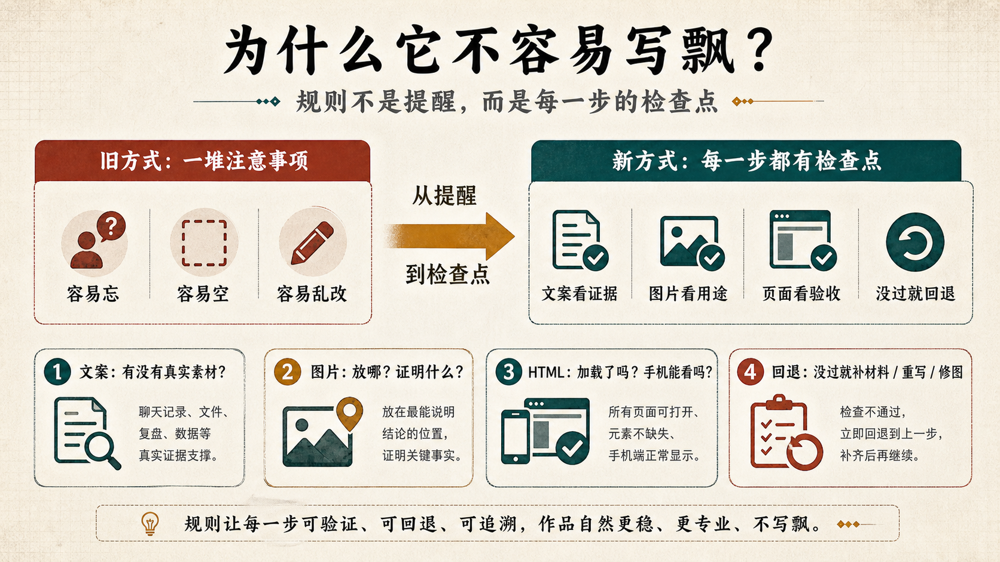
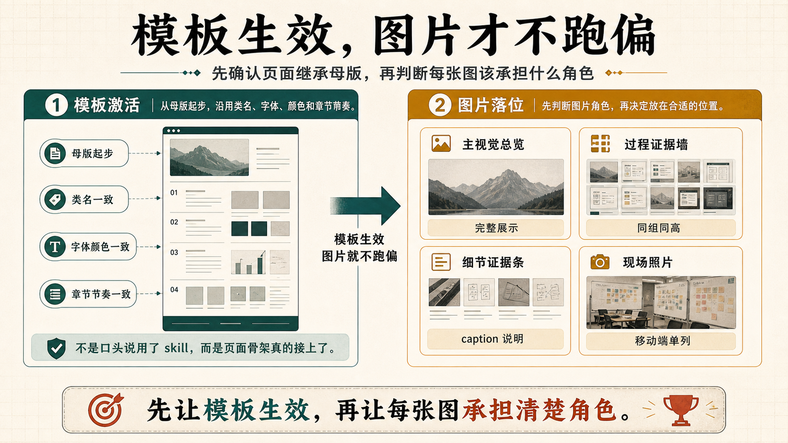
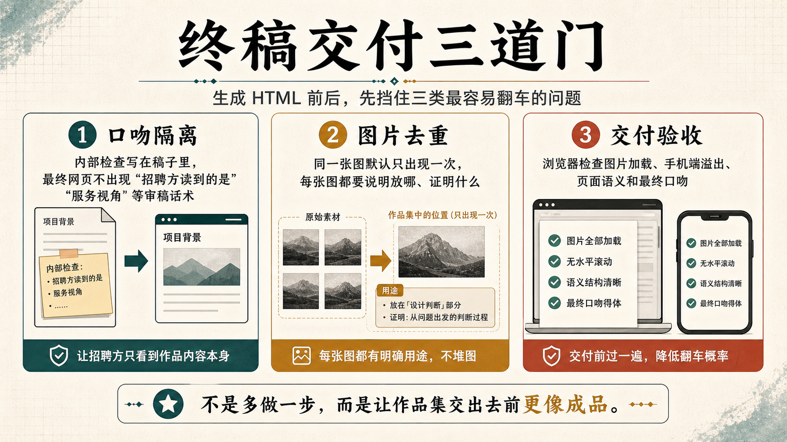

# Magazine Portfolio Skill



一句话说：这是一个给设计师、产品经理、独立创作者用的作品集网页 skill。它帮你把聊天记录、项目截图、复盘文档、图片文件夹，整理成一页招聘方能独立读懂的长滚动作品集网页。

它不是单纯的 HTML 模板。它更像一个作品集制作流程：先读懂素材，再写清项目故事，再放图片，最后生成网页并检查。

它是在 [`guizang-ppt-skill`](https://github.com/op7418/guizang-ppt-skill) 的基础上，针对“求职作品集”这个更垂直的场景做的再迭代：保留杂志风、网页化表达和视觉节奏，但把重点从“演讲展示”改成“招聘方自己阅读”。

---

## 最近更新

### 2026-05-29 · 模板激活与图片落位

2026-05-29 这版补的是“同一个 skill 怎么真的生效”：先确认页面继承母版、类名、字体颜色和章节节奏，再按图片角色决定总览、过程墙、细节条或现场照片，避免画风跑偏和图片被裁坏。

### 2026-05-27 · 终稿交付三道门

2026-05-27 这版补的是“交付前最后一关”：新增终稿口吻隔离、图片证据去重、浏览器验收三道检查，让作品集交出去前更像成品。

### 2026-05-26 · README 通俗化和配图说明

2026-05-26 这版重写了 README 的介绍方式：把说明对象从“维护者”改成“设计师和创作者”，新增三张中文信息图，并把它和 `guizang-ppt-skill` 的关系改成“同一套视觉基因在不同场景里的延展”。

---

## 它解决什么问题

很多作品集不是做不出来，而是卡在这几件事上：

- 素材很多，但不知道怎么讲成一个项目故事。
- AI 写出来很漂亮，但像空话，不像真实经历。
- 图片放进页面后，图文关系不清楚。
- 用户只想加图，AI 却顺手改了文案。
- 页面生成完了，但没有认真看浏览器效果。

这个 skill 的目标很简单：让作品集从“素材堆”变成“招聘方看得懂、信得过、能判断你能力”的项目页。

---

## 它怎么帮你做



完整流程可以理解成 5 步：

| 步骤 | 做什么 | 产出 |
|---|---|---|
| 1. 给素材 | 你提供截图、复盘、聊天记录、文件夹 | 素材入口 |
| 2. 找重点 | 从素材里找真实问题、你的动作、证据 | 源材料拆解 |
| 3. 写文案 | 先写事实，再写标题和金句 | 作品页文案稿 |
| 4. 放图片 | 每张图确认放哪、证明什么 | 图片落位表 |
| 5. 生成网页 | 做成长滚动 HTML，并用浏览器检查 | 单文件作品集网页 |

重点是：不要一上来就写页面。先把项目讲清楚，页面才会稳。

---

## 新版最大的变化：每一步都有检查点

过去很多规则会失效，是因为它们只是“提醒”：比如不要乱写、不要乱改文案、记得检查图片。任务一长，模型就容易忘。

新版把这些提醒改成检查点：每个阶段结束都要回答“做了什么、检查了什么、哪里没过、下一步怎么办”。如果没过，就不能继续往下走。



简单说：

```text
规则 = 什么时候触发 + 用在哪一步 + 要读哪些文件 + 怎么检查 + 没过怎么办
```

例子：

| 场景 | 检查点 | 没过怎么办 |
|---|---|---|
| 写文案 | 这句话有没有真实素材支撑？ | 没有就删掉或降级 |
| 进图 | 这张图放哪里、证明什么？ | 说不清就先不放 |
| 只加图 | 有没有改动已确认文案？ | 改了就撤回 |
| 生成网页 | 图片是否加载、手机端是否溢出？ | 回去修页面 |

详细规则放在 [`references/rule-gates.md`](./references/rule-gates.md)，但普通使用者只需要记住一句：每一步都要检查，没过就回退。

---

## 2026-05-29 更新：模板激活与图片落位

这次更新主要补的是“同一个 skill 为什么有时没跑出同一套效果”。问题通常不在文案，而在两个地方：模板没有真正接管页面，图片也没有先判断角色。



可以理解成两道前置判断：

| 判断 | 要看什么 | 没过怎么办 |
|---|---|---|
| 模板激活 | 页面是否从母版起步，是否沿用类名、字体颜色和章节节奏 | 先回到 `assets/template.html` 或已验证母版页起步 |
| 图片落位 | 每张图承担什么角色：主视觉总览、过程证据墙、细节证据条、现场照片 | 先标图片角色，再决定放在哪一屏和怎么展示 |

这次还把“火种车图片处理法”单独沉淀成 [`references/huozhongche-image-layout.md`](./references/huozhongche-image-layout.md)：内容图优先完整展示，照片可以更灵活；同组图片要同高，移动端要变单列，caption 要像介绍而不是审稿。

---

## 2026-05-27 更新：终稿交付三道门

这次更新主要补的是“最后交付前怎么别翻车”。它不是为了多加流程，而是把最容易让作品集显得不成熟的地方提前挡住。



可以理解成三道门：

| 门 | 检查什么 | 为什么重要 |
|---|---|---|
| 口吻隔离 | 内部检查可以写在稿子里，但最终网页不能出现“招聘方读到的是”“服务视角”等审稿话术 | 让页面像成品作品集，不像过程文档 |
| 图片去重 | 同一张图默认只出现一次，每张图都要说明放哪、证明什么 | 避免堆图，让图片变成证据 |
| 交付验收 | 浏览器检查图片加载、手机端溢出、页面语义和最终口吻 | 交出去前先过一遍真实阅读体验 |

新增的 `HTML内容架构稿` 就是为了解决第一件事：先把内部判断转成真正会出现在网页里的标题、正文、引用和图片说明，再生成 HTML。

---

## 你会得到什么

一次完整使用，通常会得到这些东西：

| 产物 | 用途 |
|---|---|
| `项目入口-XXX.md` | 用 7 个问题先把项目说清楚 |
| `原文摘录与真实问题拆解-XXX.md` | 从真实素材里找问题、动作和证据 |
| `素材采集表-XXX.md` | 每个主张对应哪些图片、截图、记录 |
| `作品页-XXX-内容架构稿.md` | 4 个章节，安排页面骨架 |
| `作品页-XXX-文案稿.md` | 先确认文案，再进入 HTML 内容架构稿 |
| `作品页-XXX-HTML内容架构稿.md` | 把内部检查口吻转成最终网页内容 |
| `index.html` | 最终长滚动作品集网页 |
| 图片落位表 / 素材清单 | 记录每张图放哪里、证明什么 |

最终网页是单文件 HTML，可以直接用浏览器打开。

---

## 适合谁

适合：

- 设计师、产品经理、独立创作者做求职作品集。
- 你手里有素材，但还没有讲成一个完整项目故事。
- 你希望作品集能被招聘方独立阅读，不需要你在旁边解释。
- 你需要真实图片、截图、过程证据进入页面。

不适合：

- 线下演讲 PPT。请用 [guizang-ppt-skill](https://github.com/op7418/guizang-ppt-skill)。
- 数据看板、课程课件、大段表格报告。
- 多页面整站、后端 API、复杂 SEO 工程。
- 编造不存在的项目、客户、数据或评价。

---

## 怎么触发

安装后，说这些话就适合调用它：

- “做一份长滚动作品集”
- “把这个项目素材整理成作品集网页”
- “做一个招聘方能读懂的项目页”
- “先做内容架构稿，再做 HTML”
- “只进图，不改文案”
- “这个作品集写得太空，帮我重新梳理”

---

## 安装

### Codex 安装

```bash
git clone https://github.com/xiangzi-cyber/magazine-portfolio-skill.git ~/.codex/skills/magazine-portfolio-skill
```

已安装过旧版时更新：

```bash
git -C ~/.codex/skills/magazine-portfolio-skill pull
```

### Claude Code 手动安装

```bash
git clone https://github.com/xiangzi-cyber/magazine-portfolio-skill.git ~/.claude/skills/magazine-portfolio-skill
```

---

## 文件结构

```text
magazine-portfolio-skill/
├── SKILL.md
├── README.md
├── CHANGELOG.md
├── assets/
│   ├── template.html
│   ├── readme-cover.png
│   ├── workflow-for-designers.png
│   ├── rules-as-checkpoints.png
│   ├── final-review-gates.png
│   └── template-and-image-gates.png
├── prompts/
│   └── readme-illustrations.md
└── references/
    ├── rule-gates.md
    ├── workflow.md
    ├── 7-questions.md
    ├── content-architecture.md
    ├── material-collection.md
    ├── image-intake-and-screenshot-proof.md
    ├── huozhongche-image-layout.md
    ├── template-activation-and-brand-system-gate.md
    ├── sections.md
    ├── components.md
    ├── themes.md
    ├── content-density.md
    ├── image-prompts.md
    └── checklist.md
```

核心文件：

| 文件 | 作用 |
|---|---|
| `SKILL.md` | skill 入口，告诉 AI 怎么调用这套流程 |
| `references/rule-gates.md` | 新版检查点系统，防止规则被忽略 |
| `references/workflow.md` | 从素材到文案稿的完整流程 |
| `references/image-intake-and-screenshot-proof.md` | 图片入库、截图证据板、只进图不改文案 |
| `references/checklist.md` | HTML 和视觉交付前检查清单 |
| `assets/template.html` | 可运行的长滚动网页模板 |

---

## 和 guizang-ppt-skill 的关系

这个 skill 不是从零开始做的。它是在 [`guizang-ppt-skill`](https://github.com/op7418/guizang-ppt-skill) 的基础上，沿着同一套“杂志风网页表达”继续往下做的一个垂直场景版本。

`guizang-ppt-skill` 给了它很重要的底子：网页化表达、杂志感版式、电子墨水气质、图文节奏和单文件 HTML 的轻交付方式。`magazine-portfolio-skill` 保留这些基因，然后把使用场景收窄到“求职作品集”和“项目复盘页”。

为什么要单独做这个版本？因为求职作品集有一些很具体的痛点：

- 招聘方通常不会听你现场讲，页面要自己把项目说清楚。
- 作品集不能只好看，还要让人相信你真的做过、判断过、落地过。
- 素材很多时，AI 很容易写成空泛方法论，所以要先从真实素材里找证据。
- 图片不是装饰，而是作品证据；每张图都要知道放在哪里、证明什么。
- 页面做完还要检查图片、排版、手机端和浏览器效果，不能生成完就结束。

所以它更像是 guizang 美学在“求职作品集”场景里的延展：一个偏演讲展示，一个偏静态阅读；一个适合现场讲，一个适合招聘方自己慢慢看。两者不是替代关系，也不是高低关系，而是同一套视觉基因在不同使用场景里的两个方向。

实际使用时，它们也可以配合：同一份项目素材，先用 `magazine-portfolio-skill` 做招聘方阅读版；如果后面要路演、分享或汇报，再用 `guizang-ppt-skill` 做演讲版。

---

## License

[MIT License](./LICENSE)
